````markdown
# 🚀 Vedix.Ai

<p align="center">


</p>

<p align="center">
<b>An AI-Powered Full Stack Web Platform for Intelligent Conversations, Resume Analysis, Research Assistance, Live News Exploration, and Administrative Management.</b>
</p>

---

# 📖 Project Description

**Vedix.Ai** is a modern AI-powered web application designed to provide multiple productivity tools through a single platform.

The application enables users to communicate with AI, upload images for AI-assisted prompting, analyze resumes, evaluate research papers, browse live news, and manage subscription plans. It also includes a comprehensive **Admin Dashboard** that allows administrators to manage users, platform modules, analytics, AI settings, and application configurations without redeploying the application.

The project follows a scalable MERN architecture with secure authentication, REST APIs, and cloud deployment.

---

# ✨ Features

## 🔐 User Authentication

- User Registration
- Secure Login
- Google Sign-In
- JWT Authentication
- Protected Routes
- Role-Based Authorization
- Admin Access Control

---

## 🤖 AI Chat

- AI Conversation
- Smart Prompt Processing
- Image Prompt Support
- Voice Input
- Text-to-Speech
- Copy AI Response
- Chat History

---

## 📰 Explore News

- Live News Feed
- Search News
- Refresh News
- Hero News Banner
- Live News Ticker
- Calendar & Time
- Multiple Categories

### Categories

- Top Stories
- Technology
- Business
- Sports
- Science
- Health

---

## 📄 Resume Analyzer

Upload resumes and receive AI-powered insights including:

- Resume Score
- Suitable Job Roles
- Skill Detection
- Strength Analysis
- Weakness Detection
- Missing Skills
- Resume Improvement Suggestions

Job recommendations from:

- LinkedIn
- Internshala
- Unstop
- Indeed
- Naukri

---

## 📚 Research Paper Analyzer

Analyze research papers using AI.

Features include:

- AI Summary
- Methodology Analysis
- Findings Extraction
- Limitations Detection
- Missing Content Suggestions
- Improvement Recommendations
- Related Articles
- Similar Research Papers

---

## 💳 Subscription Plans

- Free
- Pro
- Premium

Features

- Usage Limits
- Credit System
- Admin Editable Pricing
- Plan Management
- Upgrade/Downgrade

---

# 👨‍💼 Admin Panel

A complete administrative dashboard with powerful management tools.

### Dashboard

- Overview Cards
- Analytics
- Recent Activity
- AI Usage
- Platform Statistics

### User Management

- View Users
- Search Users
- Edit User
- Delete User
- Change Subscription
- Edit Credits
- Block/Unblock

### Platform Modules

- Dashboard
- Users
- Subscriptions
- Payments
- AI Models
- Prompt Studio
- Knowledge Base
- Resume Analyzer
- Research Analyzer
- Documents
- Chats
- Credits
- Analytics
- Logs
- Notifications
- CMS
- Support
- Security
- Settings
- Admin Management
- AI Cost Monitor
- Feature Flags

Each module supports:

- Enable
- Disable
- Pause
- Edit Description
- Owner
- Action URL
- Notes

---

# 🛠 Tech Stack

| Category | Technology |
|------------|------------|
| Frontend | React, Vite |
| Styling | CSS3 |
| Routing | React Router |
| HTTP Client | Axios |
| Icons | React Icons |
| Backend | Node.js |
| Framework | Express.js |
| Database | MongoDB |
| ODM | Mongoose |
| Authentication | JWT |
| OAuth | Google OAuth |
| AI | AI Model API |
| Deployment | Vercel + Railway |

---

# 📂 Folder Structure

```text
Vedix.Ai
│
├── frontend
│   ├── public
│   ├── src
│   │   ├── assets
│   │   ├── components
│   │   ├── pages
│   │   ├── hooks
│   │   ├── layouts
│   │   ├── routes
│   │   ├── services
│   │   ├── context
│   │   ├── utils
│   │   └── App.jsx
│   └── package.json
│
├── backend
│   ├── controllers
│   ├── middleware
│   ├── routes
│   ├── models
│   ├── services
│   ├── config
│   ├── utils
│   ├── uploads
│   ├── app.js
│   └── server.js
│
└── README.md
````

---

# 📸 Application Screenshots & Detailed Showcase

Below is a complete visual tour of **Vedix.Ai**, detailing every major module, feature preview, and platform interface along with deep explanations of their underlying capabilities.

---

### 1. 🏠 Home Page Dashboard (`home1.png`)

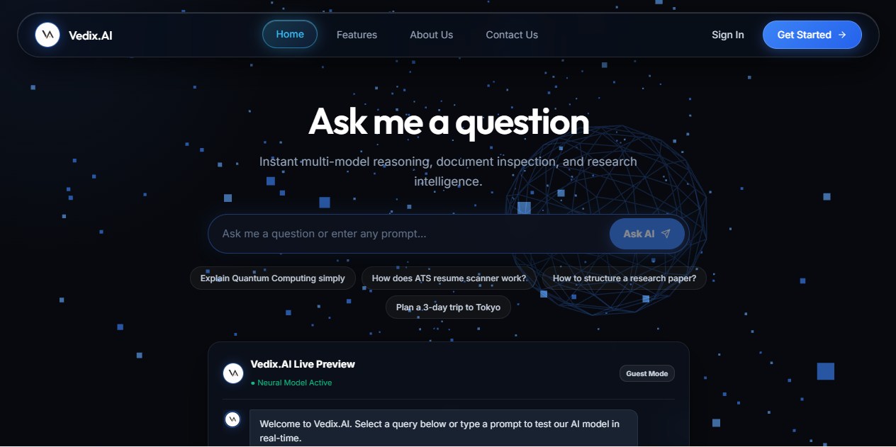

> **Overview**: The central command hub of Vedix.AI engineered with a modern glassmorphic theme, hero animations, dynamic interactive banners, and quick-access navigation to all AI power tools.

- **Key Highlights**:
  - **Quick Tool Launchpad**: Direct entry points for AI Chat, Resume Analyzer, Research Assistant, and Live News.
  - **Platform Live Stats**: Real-time counter metrics showcasing processed requests, active models, and response speeds.
  - **Seamless Navigation**: Fully responsive dark mode aesthetic with instant guest mode access.

---

### 2. ⚡ Core Platform Features Showcase (`features.png`)

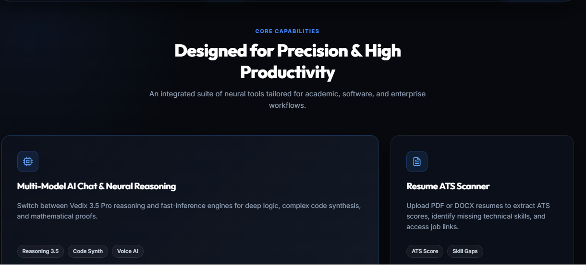

> **Overview**: A visual matrix highlighting Vedix.AI's modular suite of AI micro-services designed to streamline productivity, research, and content consumption.

- **Key Highlights**:
  - **Feature Grid Cards**: Interactive cards detailing capability badges and status indicators for each tool.
  - **Modular Microservices**: Independent AI engines tailored for specific workflows (ATS checking, paper summary, itinerary planning).
  - **Visual Badging**: Instant clarity on free vs. pro level AI features.

---

### 3. 🤖 Multi-Model AI Chat Interface (`chat.png`)

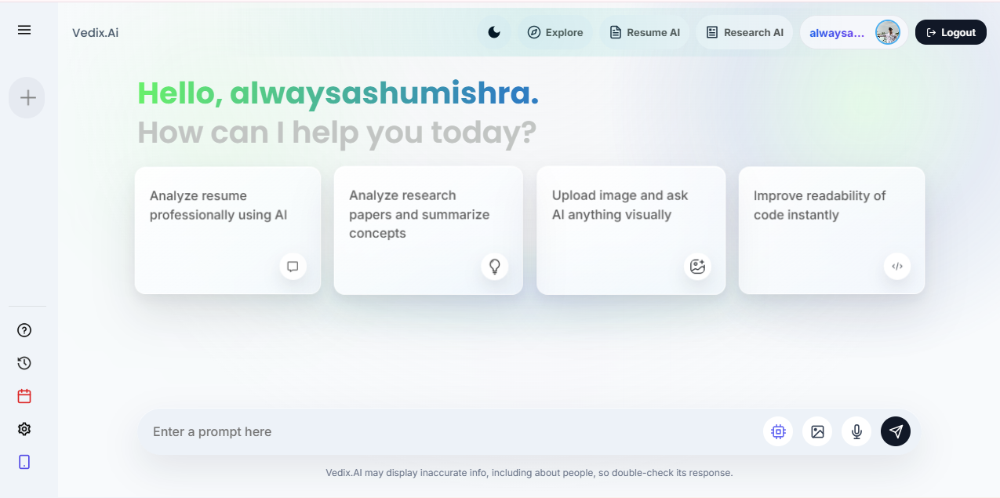

> **Overview**: A state-of-the-art conversational workspace enabling multi-turn dialogues with advanced AI models, context memory, multimodal image attachment processing, and voice interaction.

- **Key Highlights**:
  - **Multimodal Uploads**: Analyze images, code snippets, and structured prompts directly within the chat stream.
  - **Voice & Speech Support**: Speech-to-text dictation and real-time Text-to-Speech audio response playback.
  - **Code Execution & Syntax Highlighting**: One-click code copying, formatted markdown responses, and session persistence.

---

### 4. 📰 Real-Time Live News Intelligence (`news.png`)

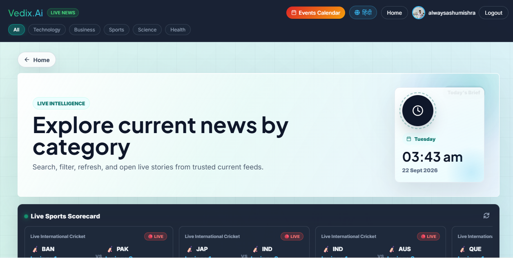

> **Overview**: An AI-curated news hub aggregating real-time global news, breaking tech headlines, market trends, and scientific research into structured visual media cards.

- **Key Highlights**:
  - **Categorized News Feed**: Filter stories across Top Stories, Technology, Business, Science, Health, and Sports.
  - **Live News Ticker & Widgets**: Real-time scrolling news ticker, live date/calendar widget, and instant search bar.
  - **Source Transparency**: Direct links to trusted publisher sources with concise AI-generated summary snippets.

---

### 5. 📄 AI Resume ATS & Career Scanner (`resume.png`)

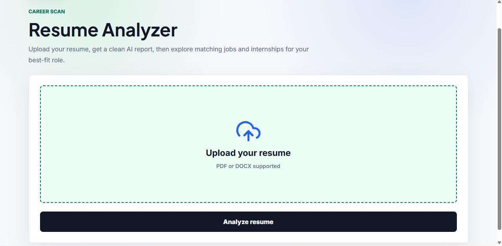

> **Overview**: An intelligent career assistant that scans resumes against Applicant Tracking System (ATS) algorithms to provide actionable formatting tips, skill gap analysis, and tailored job role suggestions.

- **Key Highlights**:
  - **ATS Compatibility Score**: Automated numeric rating evaluating formatting, keyword density, and readability.
  - **Skills & Gap Detection**: Clear breakdown of detected technical skills versus critical missing keywords.
  - **Job Portal Links**: Direct recommendations linked to top portals (LinkedIn, Internshala, Indeed, Naukri, Unstop).

---

### 6. 📚 Academic Research Paper Analyzer (`research.png`)

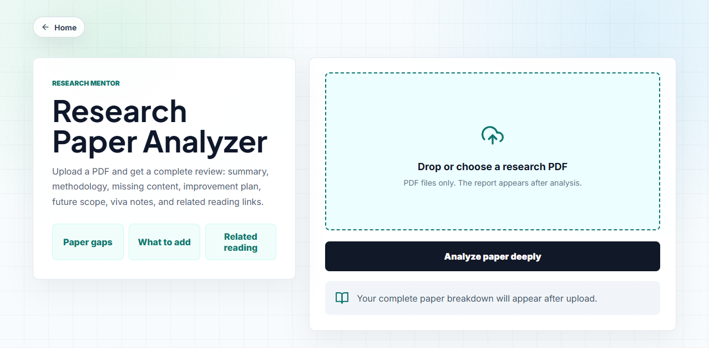

> **Overview**: Tailored for researchers, academics, and students to quickly extract key insights, methodologies, findings, and limitations from complex scientific papers.

- **Key Highlights**:
  - **Executive Summaries**: AI-synthesized breakdowns of dense literature into concise bulleted insights.
  - **Methodology & Limitation Parsing**: Automated identification of study constraints, data sampling, and future work.
  - **Citation & Related Work Suggestions**: Discover connected papers, related research topics, and reference links.

---

### 7. 📝 Smart Notes & Knowledge Vault (`notes.png`)

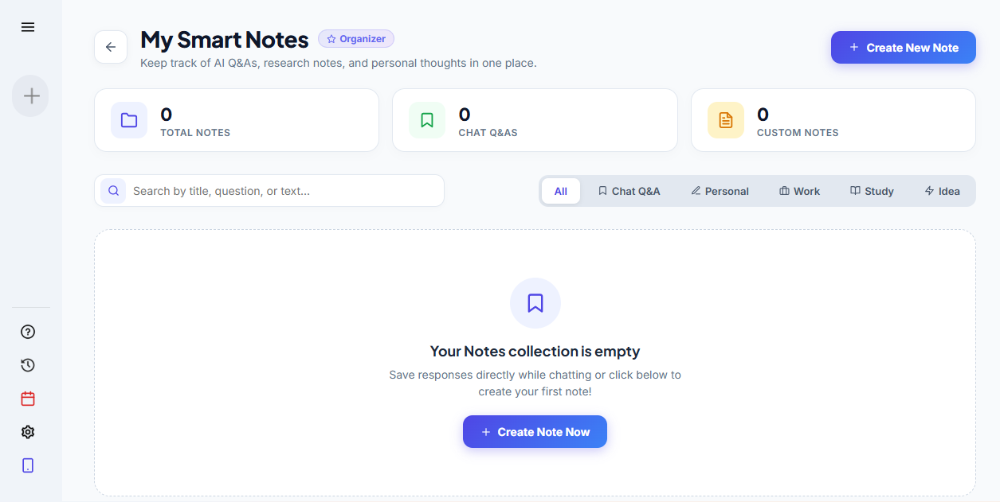

> **Overview**: A unified workspace for taking notes, organizing study materials, saving AI prompt responses, and building a searchable personal knowledge base.

- **Key Highlights**:
  - **Markdown & Tagging**: Full markdown formatting support with custom tags for effortless filtering.
  - **AI Auto-Summarizer**: Convert lengthy study notes or meeting transcripts into concise bullet points.
  - **Fast Search & Cloud Sync**: Instant instant-search bar and persistent cloud storage across user sessions.

---

### 8. 👥 Collaborative Study & Team Groups (`group.png`)

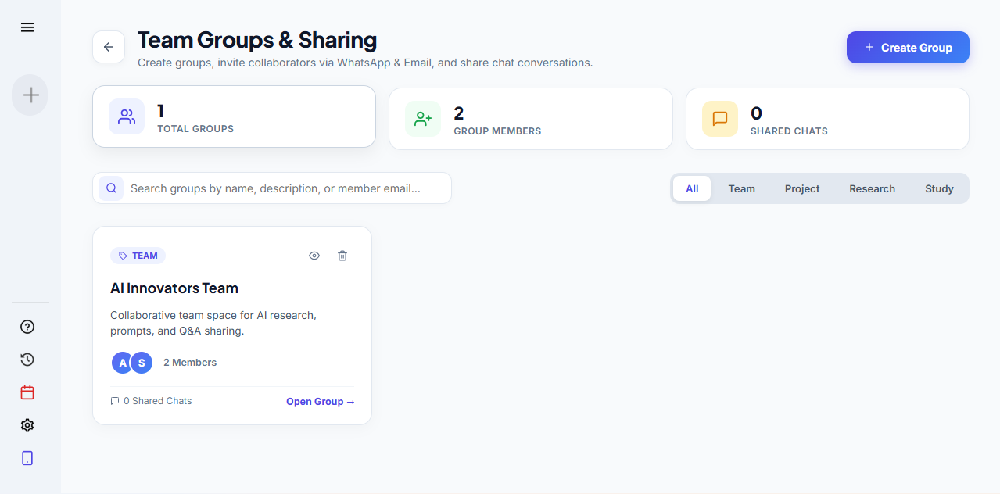

> **Overview**: A collaborative community feature allowing users to form study circles, project teams, or peer groups to share research findings, study notes, and custom AI prompts.

- **Key Highlights**:
  - **Group Workspaces**: Create public or private team spaces with unique join codes and invite links.
  - **Shared Resource Hub**: Centralized repository for team notes, shared paper summaries, and discussion threads.
  - **Role-Based Access**: Group admin management, member permissions, and shared team feeds.

---

### 9. ✈️ Autonomous AI Travel Agent (`travel.png`)

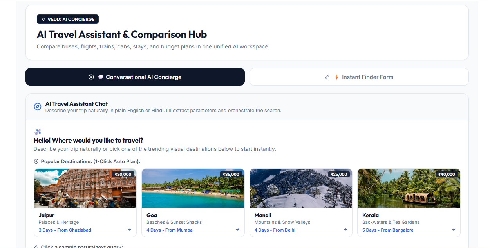

> **Overview**: An intelligent travel planner that constructs tailored trip concepts based on target destination, budget constraints, trip duration, companion preferences, and travel style.

- **Key Highlights**:
  - **Personalized Recommendations**: AI-driven itinerary suggestions matching budget tiers (Backpacker, Luxury, Family).
  - **Smart Prompt Templates**: Preset destination ideas and activity filters for instant planning.
  - **Interactive Travel Inputs**: Custom preference selectors for solo travelers, couples, or group trips.

---

### 10. 🗺️ Detailed Travel Itineraries & Schedules (`travel1.png`)

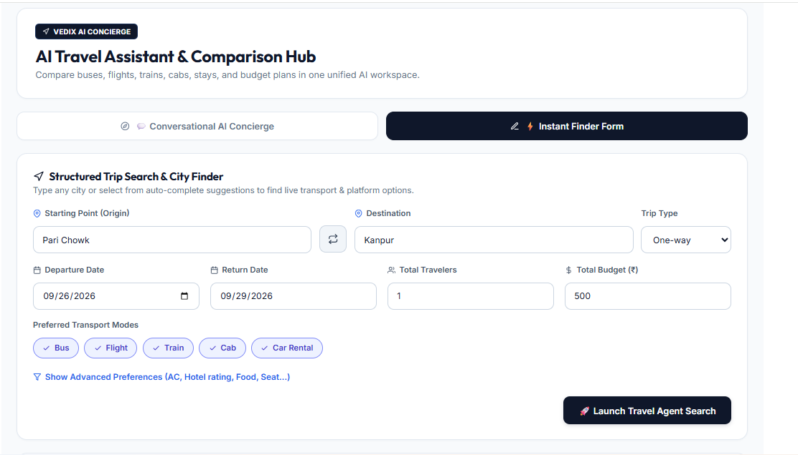

> **Overview**: An operational day-by-day travel guide providing hourly activity timelines, local food recommendations, stay suggestions, and budget breakdowns.

- **Key Highlights**:
  - **Day-by-Day Timeline**: Morning, afternoon, and evening structured itineraries with route suggestions.
  - **Expense Optimization**: Clear estimated breakdown for accommodations, transport, food, and sightseeing.
  - **Exportable Guide**: Print-ready and downloadable travel plan layout for offline access.

---

### 11. 👤 User Profile & Subscription Management (`profile.png`)

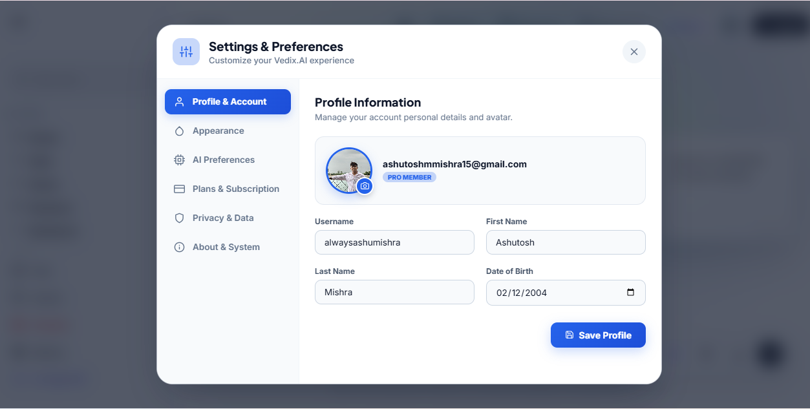

> **Overview**: A comprehensive personal dashboard detailing user profile information, active subscription plan tier, remaining AI credits, and account security controls.

- **Key Highlights**:
  - **Credit Meter**: Live usage tracker displaying daily/monthly AI query consumption.
  - **Subscription Upgrades**: Seamless plan switching between Free, Pro, and Premium tiers.
  - **OAuth & Security**: Managed connected authentication providers (Google OAuth) and password settings.

---

### 12. 📩 Contact & Feedback Support Portal (`contactus.png`)

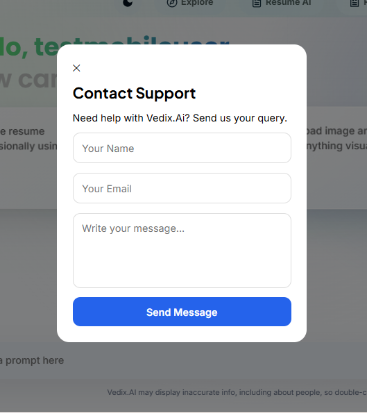

> **Overview**: A responsive user feedback interface allowing community members to submit bug reports, feature requests, or technical inquiries directly to the development team.

- **Key Highlights**:
  - **Interactive Form Controls**: Structured input fields with real-time validation feedback.
  - **Support Categories**: Quick tags for Bug Reports, Feature Suggestions, General Support, and Business Inquiries.
  - **Automated Confirmation**: Instant status updates and submission verification alerts.

---

### 13. 🔐 Secure Authentication & Sign In Modal (`login.png`)

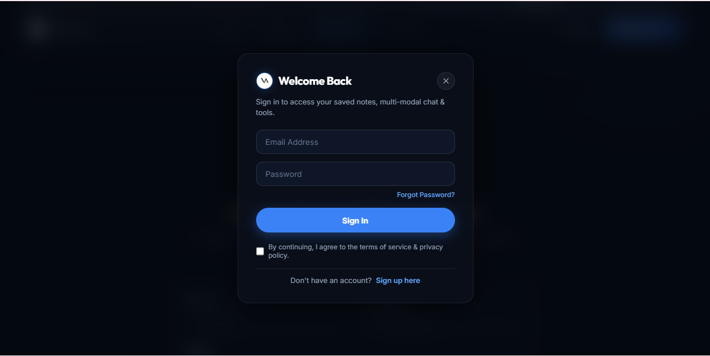

> **Overview**: A dual-purpose modal interface facilitating quick login and account registration with email credentials or 1-click Google OAuth 2.0 integration.

- **Key Highlights**:
  - **1-Click Google OAuth**: Fast social login backed by JWT token security.
  - **Instant Guest Login**: Quick preview mode for first-time visitors to explore core features.
  - **Form Validation & Recovery**: In-line error handling, toggleable password fields, and account recovery triggers.

---

# ⚙ Installation

## Clone Repository

```bash
git clone https://github.com/yourusername/vedix-ai.git

cd vedix-ai
```

---

## Install Frontend

```bash
cd frontend

npm install
```

---

## Install Backend

```bash
cd backend

npm install
```

---

# 🔑 Environment Variables

## Frontend (.env)

```env
VITE_API_BASE_URL=http://localhost:5000/api

VITE_BACKEND_URL=http://localhost:5000

VITE_GOOGLE_CLIENT_ID=YOUR_GOOGLE_CLIENT_ID
```

---

## Backend (.env)

```env
PORT=5000

MONGO_URI=YOUR_MONGODB_URI

JWT_SECRET=YOUR_SECRET_KEY

GOOGLE_CLIENT_ID=YOUR_GOOGLE_CLIENT_ID

GROQ_API_KEY=YOUR_GROQ_KEY

# OR

AI_API_KEY=YOUR_AI_API_KEY

ADMIN_EMAILS=admin@example.com,owner@example.com
```

---

# ▶ Running Locally

## Backend

```bash
npm run dev
```

---

## Frontend

```bash
npm run dev
```

---

Frontend

```
http://localhost:5173
```

Backend

```
http://localhost:5000
```

---

# 🌐 Backend API Overview

| Endpoint                    | Method | Description       |
| --------------------------- | ------ | ----------------- |
| /api/auth/register          | POST   | Register User     |
| /api/auth/login             | POST   | Login             |
| /api/auth/google            | POST   | Google Login      |
| /api/chat                   | POST   | AI Chat           |
| /api/news                   | GET    | News Feed         |
| /api/analyze/resume         | POST   | Resume Analysis   |
| /api/analyze/research-paper | POST   | Research Analysis |
| /api/subscription           | GET    | Plans             |
| /api/users                  | GET    | User Profile      |
| /api/admin/summary          | GET    | Dashboard Summary |
| /api/admin/users            | GET    | Manage Users      |
| /api/admin/config           | GET    | Admin Config      |

---

# 🛡 Admin Panel

The Admin Panel provides centralized platform management.

Features include:

* Dashboard Overview
* User Management
* Credits Management
* Subscription Management
* Platform Settings
* AI Configuration
* CMS
* Notifications
* Logs
* Analytics
* API Monitoring
* Feature Flags
* Security Controls
* Admin Notes

Admin access is controlled through:

```env
ADMIN_EMAILS
```

Only registered email addresses in this environment variable can access the Admin Dashboard.

---

# 🚀 Deployment

## Frontend (Vercel)

```bash
npm run build
```

Deploy the **frontend** directory to Vercel.

Environment Variables:

```
VITE_API_BASE_URL

VITE_BACKEND_URL

VITE_GOOGLE_CLIENT_ID
```

---

## Backend (Railway)

Deploy the backend folder to Railway.

Environment Variables

```
MONGO_URI

JWT_SECRET

GOOGLE_CLIENT_ID

GROQ_API_KEY

ADMIN_EMAILS
```

Example Backend

```
https://vedixai-production.up.railway.app
```

API Base URL

```
https://your-backend-url/api
```

---

# 📘 Usage Guide

1. Register or Login.
2. Authenticate using Google or Email.
3. Start chatting with AI.
4. Upload images for AI prompts.
5. Analyze resumes.
6. Upload research papers.
7. Browse live news.
8. Upgrade subscription.
9. Access Admin Dashboard (Authorized Users Only).

---

# 🔒 Security Notes

* JWT Authentication
* Password Hashing
* Protected Routes
* Google OAuth
* Role-Based Authorization
* Secure Environment Variables
* Input Validation
* Error Handling
* MongoDB Injection Protection
* API Authentication
* CORS Configuration

---

# 🚀 Future Improvements

* AI Image Generation
* AI Document Chat
* Team Workspaces
* Multi-language Support
* Dark/Light Theme
* Email Notifications
* Payment Gateway Integration
* Chat History Search
* AI Memory
* Usage Analytics Dashboard
* Mobile Application
* Real-Time Notifications
* AI Agents Marketplace
* Voice Conversations
* AI Workflow Automation

---

# 🤝 Contributing

Contributions are welcome.

1. Fork the repository.
2. Create a new branch.

```bash
git checkout -b feature/new-feature
```

3. Commit your changes.

```bash
git commit -m "Add new feature"
```

4. Push your branch.

```bash
git push origin feature/new-feature
```

5. Create a Pull Request.

---

# 📄 License

This project is licensed under the **MIT License**.

---

# 👨‍💻 Author

**Ashutosh Mishra**

B.Tech CSE (AI & ML)

Full Stack Developer | Frontend Developer | AI Enthusiast

---

## ⭐ Support

If you found this project useful, consider giving it a **⭐ Star** on GitHub.

It motivates further development and helps others discover the project.

---

<p align="center">
Made with ❤️ using React, Node.js, Express, MongoDB and AI.
</p>
```
